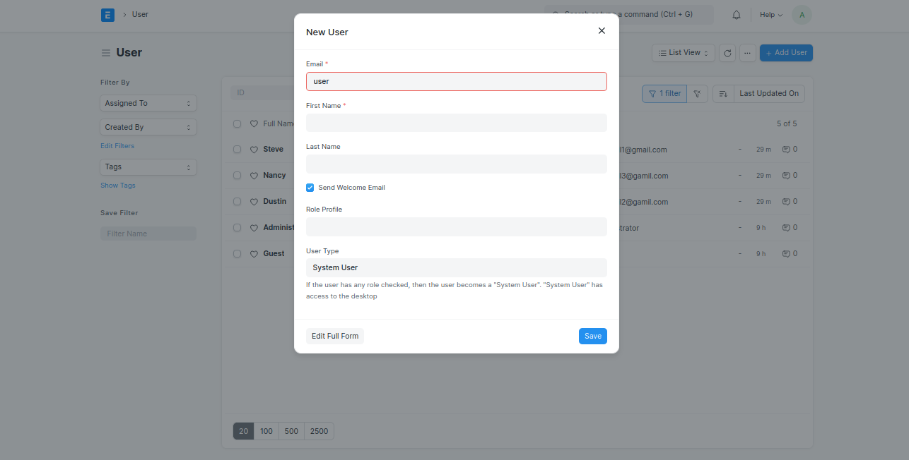
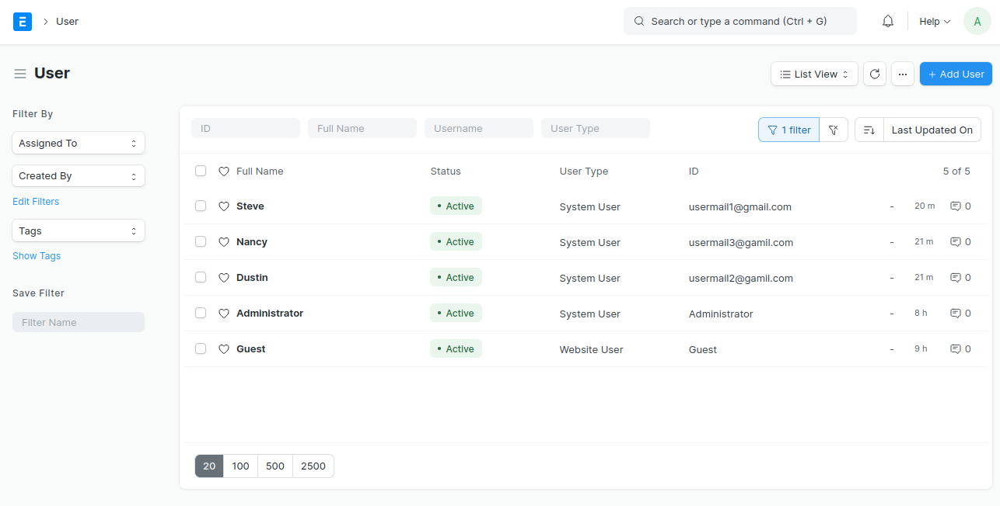
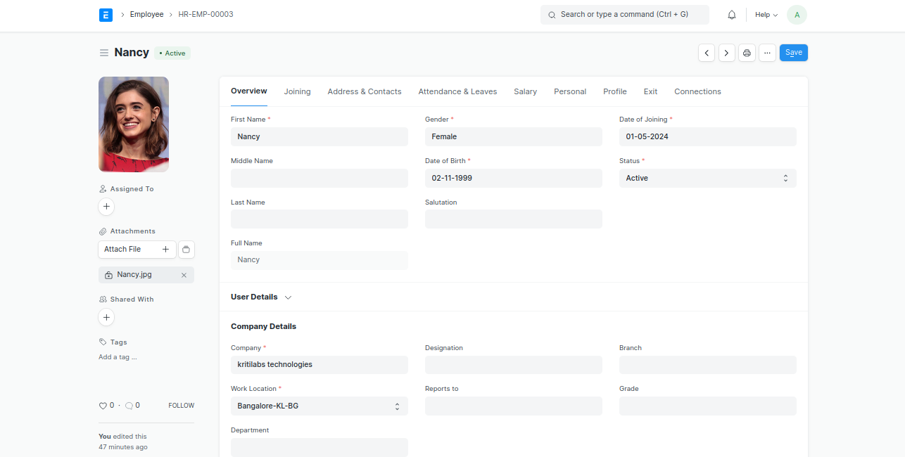
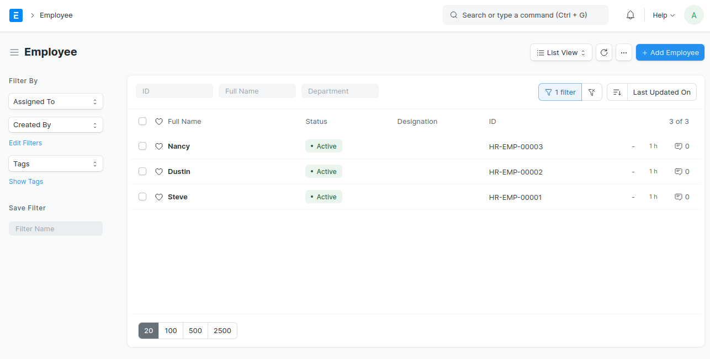
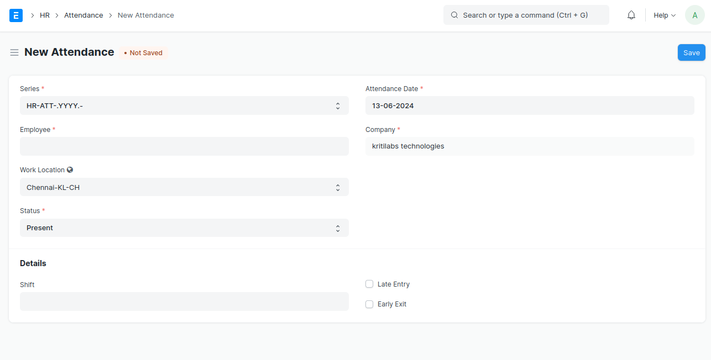
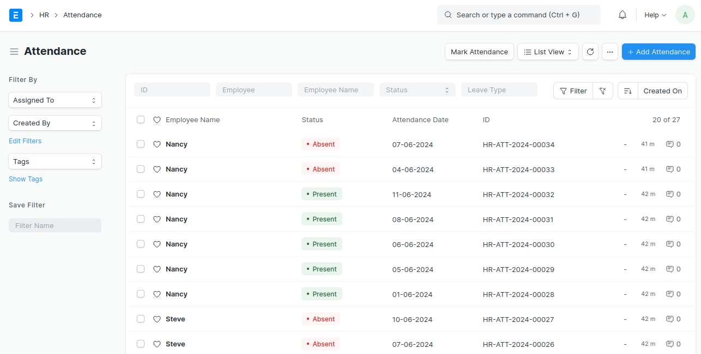
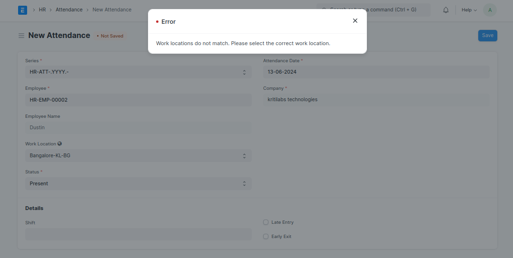

# ERPNext Location-Based Attendance System

This guide will help you set up an ERPNext system where employees can only mark attendance for their specific locations using the ERPNext mobile application.

## Prerequisites

- ERPNext instance installed and running.
- Administrative access to the ERPNext instance.

## Steps

### 1. Create User

1. Go to **Home > Users and Permissions > User**.
2. Click on **New**.
3. Fill in the required fields (email, full name, etc.).
4. Assign roles (e.g., Employee, Attendance User).

**Screenshot:**



### 2. Create Employee

1. Go to **Home > Human Resources > Employee**.
2. Click on **New**.
3. Fill in the required fields (employee name, employee number, etc.).
4. Link the user created in step 1 in the **User ID** field.

**Screenshot:**




### 3. Setup Attendance

1. Go to **Home > Human Resources > Attendance**.
2. Click on **New**.
3. Fill in the required fields (employee, date, etc.).

**Screenshot:**



### 4. Setup Work Location

#### Add Worklocation Field to Employee Doctype

1. Go to **Home > Customization > Customize Form**.
2. In the **Enter Form Type** field, type and select **Employee and Attendance**.
3. Scroll down to the **Fields** section.
4. Click on **Add Row** to add a new field.
5. Fill in the details:
    - **Label:** Work Location
    - **Fieldtype:** select
6. Click on **Save**.

**Screenshot:**



### 5. Mark Attendance with Work Location Validation

#### Add Custom Script

1. Go to **Home > Customization > Custom Script**.
2. Click on **New** to create a new script.
3. Fill in the details:
    - **Doctype:** Attendance
    - **Script Type:** Client
    - **Script:**

```javascript
frappe.ui.form.on('Attendance', {
    validate: function(frm) {
        if (frm.doc.employee && frm.doc.custom_work_location) {
            frappe.call({
                method: 'frappe.client.get_value',
                args: {
                    doctype: 'Employee',
                    filters: { 'employee': frm.doc.employee },
                    fieldname: 'work_location'
                },
                callback: function(response) {
                    if (response.message && response.message.work_location) {
                        var employeeWorkLocation = response.message.work_location;
                        var customWorkLocation = frm.doc.custom_work_location;

                        if (employeeWorkLocation !== customWorkLocation) {
                            frappe.throw("Work locations do not match. Please select the correct work location.");
                            validated = false; // Prevent saving
                        } else {
                            validated = true; // Allow saving
                        }
                    } else {
                        frappe.msgprint("Work location not found for the selected employee.");
                        validated = false; // Prevent saving
                    }
                },
                error: function(err) {
                    frappe.msgprint("Error fetching work location: " + err);
                    validated = false; // Prevent saving
                }
            });

            // Return false to prevent default validation
            return false;
        }
    },

    before_save: function(frm) {
        // Additional validation or actions before saving can be added here if needed
    },

    custom_work_location: function(frm) {
        // Re-validate when custom_work_location changes
        frm.trigger('validate');
    }
});


#### License

MIT